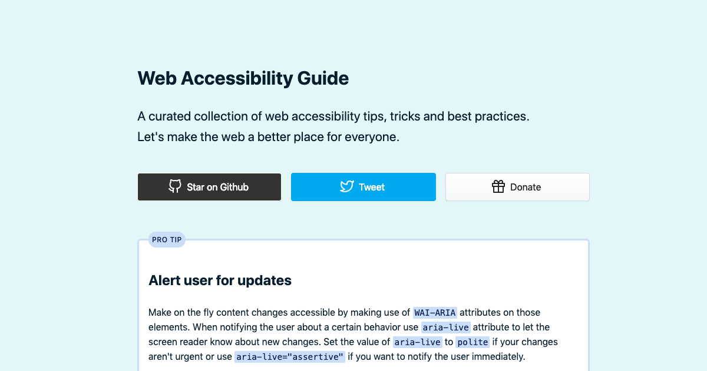

<h1 align="center">
  Accessibility Guide
</h1>

<h4 align="center">A curated collection of web accessibility tips, tricks and best practices</h4>

 

## Table of Contents

### Tips

View contents

* [Images with text should be accessible to screen readers](#images-with-text-should-be-accessible-to-screen-readers)
* [Always include alt tag on an image](#always-include-alt-tag-on-an-image)
* [Avoid auto-playing audio on your website](#avoid-auto-playing-audio-on-your-website)
* [Always feature optimal contrast](#always-feature-optimal-contrast)
* [Don't remove `:focus` on elements](#dont-remove-focus-on-elements)
* [Use labels on `form` fields](#use-labels-on-form-fields)
* [Make self-validating forms accessible](#make-self-validating-forms-accessible)
* [Follow heading hierarchy](#follow-heading-hierarchy)
* [Avoid non-semantic patterns](#avoid-non-semantic-patterns)
* [Use skip-links](#use-skip-links)
* [Make `tab` friendly navigation](#make-tab-friendly-navigation)
* [When you need to display tabular data use `table` instead series of `div` elements](#when-you-need-to-display-tabular-data-use-table-instead-series-of-div-elements)

### Pro Tips

View contents

* [Alert user for updates](#alert-user-for-updates)
* [Put a full stop at the end of the `alt` tag](#put-a-full-stop-at-the-end-of-the-alt-tag)
* [Allow user to stop an animation](#allow-user-to-stop-an-animation)
* [Avoid `alt` tags on images of your logo](#avoid-alt-tags-on-images-of-your-logo)
* [Tables should always include scoping in their HTML](#tables-should-always-include-scoping-in-their-html)
* [Avoid poor video captions](#avoid-poor-video-captions)

### Facts

View contents

* [HTML should have a logical flow](#html-should-have-a-logical-flow)
* [Don't rely just on Lighthouse when testing](#dont-rely-just-on-lighthouse-when-testing)
* [Improve typography on your website](#improve-typography-on-your-website)

---

## Tips
### Images with text should be accessible to screen readers

Images that contain text in them such as logos should make that text available to screen readers in some form. The most straightforward way to do this is to style a `header` element as image and use `text-indent: -9999px` as its text content.

 [⬆ Back to top](#table-of-contents)

### Always include alt tag on an image

Screen readers for the blind and visually impaired read out `alt` tag text and therefore make your images accessible. `alt` tag should describe meaningful images and be left empty if the image serves decorative purposes. Never leave the `alt` since screen readers will read the source of the image which makes for terrible user experience.

#### Resources

* [Some things about alt text](https://css-tricks.com/some-things-about-alt-text/)
 [⬆ Back to top](#table-of-contents)

### Avoid auto-playing audio on your website

Do not auto-play any audio or video material on page load. Users with screen readers will hear both 3rd party audio and their screen reader which makes for a poor user experience.

 [⬆ Back to top](#table-of-contents)

### Always feature optimal contrast

Whenever possible make your websites accessible to the eye by avoiding poor contrast between text and background.

#### Resources

* [Accessible color picker](https://cloudflare.design/color/)
* [Color contrast docs by MDN](https://developer.mozilla.org/en-US/docs/Web/Accessibility/Understanding_WCAG/Perceivable/Color_contrast)
 [⬆ Back to top](#table-of-contents)

### Don't remove `:focus` on elements

If an element is interactive never remove the highlight by setting `outline: none;` on a focused state of that element. If the default browser outline doesn't align with the design be sure to replace it with a custom accessible one instead of hiding it completely. Removing an element's highlight on focus makes filling out forms difficult for some users.

#### Resources

* [Focusing on Focus Styles](https://css-tricks.com/focusing-on-focus-styles/)
 [⬆ Back to top](#table-of-contents)

### Use labels on `form` fields

Once implemented properly, `label` elements make the form accessible. Each `label` element should have a `for` attribute that has the value of the corresponding filed's `id`.

#### Resources

* [The `label` element docs](https://developer.mozilla.org/en-US/docs/Learn/HTML/Forms/How_to_structure_an_HTML_form#The_%3Clabel%3E_element)
 [⬆ Back to top](#table-of-contents)

### Make self-validating forms accessible

If your form needs to meet specific input criteria and errors on mistaken input be sure to provide feedback to the user. Alongside the common red border include a text-based informative explanation of the encountered error.

#### Resources

* [Sensible Forms: A Form Usability Checklist](https://alistapart.com/article/sensibleforms)
 [⬆ Back to top](#table-of-contents)

### Follow heading hierarchy

Screen reader users navigate pages by using the heading structure. Do not use headings by picking the one that fits the appropriate size in design. Instead, use heading elements `h1` to `h6` with the hierarchy in mind and style them later.

#### Resources

* [Resource title](https://)
 [⬆ Back to top](#table-of-contents)

### Avoid non-semantic patterns

Use semantic HTML elements that clearly define their content as much as possible. By using semantic elements you provide the user with a more meaningful way to navigate and interact with your website. Semantic elements, such as `<header>`, `<main>` and `<article>` are by default accessible compared to non-semantic elements like `
` or ``. Avoid using non-accessible `
` when `<button>` is already available to you. If for some reason you must use non-semantic elements be sure to implement accessibility functionality to them.

#### Resources

* [Semantics in HTML](https://developer.mozilla.org/en-US/docs/Glossary/Semantics#Semantics_in_HTML)
* [The practical value of semantic HTML](https://www.brucelawson.co.uk/2018/the-practical-value-of-semantic-html/)
 [⬆ Back to top](#table-of-contents)

### Use skip-links

Let users skip long navigation by implementing invisible focusable links that leads to the main content. Screen readers perceive the page from top to bottom which means that if there is no skip-link implemented and the website is already familiar to the end user, the screen reader will read redundant navigation.

#### Resources

* [Codepen example](https://codepen.io/joe-watkins/pen/rjhiK)
 [⬆ Back to top](#table-of-contents)

### Make `tab` friendly navigation

Allow users to use keyboard-only navigation on your website by ensuring that all interactive elements are focusable and in a logical order.

#### Resources

* [Keyboard navigation explained in detail](https://webaim.org/techniques/keyboard/)
 [⬆ Back to top](#table-of-contents)

### When you need to display tabular data use `table` instead series of `div` elements

When you need to display some tabular data be sure to use the semantically correct `<table>` element as it is accessible by default, in contrast to non-semantic elements like `
`. You should provide a `<caption>` for your `<table>` element and allow users to skip through the table with a skip-link if they don't want it read by the screen reader.

#### Resources

* [Semantic table docs](https://developer.mozilla.org/en-US/docs/Web/HTML/Element/table)
 [⬆ Back to top](#table-of-contents)

## Pro Tips
### Alert user for updates

Make on the fly content changes accessible by making use of `WAI-ARIA` attributes on those elements. When notifying the user about a certain behavior use `aria-live` attribute to let the screen reader know about new changes. Set the value of `aria-live` to `polite` if your changes aren't urgent or use `aria-live="assertive"` if you want to notify the user immediately.

#### Resources

* [ARIA Live Regions](https://developer.mozilla.org/en-US/docs/Web/Accessibility/ARIA/ARIA_Live_Regions)
 [⬆ Back to top](#table-of-contents)

### Put a full stop at the end of the `alt` tag

Put a full stop at the end of an image's description inside the `alt` tag, so that screen readers can make a short pause which leads to better user experience.

 [⬆ Back to top](#table-of-contents)

### Allow user to stop an animation

Complex or even simple animations can make it hard for some users to focus on the actual content of the webpage. Therefore your website should allow users to stop animations on the webpage at a particular keyframe.

 [⬆ Back to top](#table-of-contents)

### Avoid `alt` tags on images of your logo

Hearing screen readers pronounce the description of your logo over and over gets tiresome. Use a descriptive `alt` tag just on the first image of your logo. Remember to include an empty `alt` tag on others since screen readers will read the image source as the fallback.

 [⬆ Back to top](#table-of-contents)

### Tables should always include scoping in their HTML

Although `scope` attributes aren't mandatory in `table` elements it's is highly recommended to use the `scope` to indicate what type of data each column contains and what should be read out as a row.

#### Resources

* [HTML table advanced features and accessibility](https://developer.mozilla.org/en-US/docs/Learn/HTML/Tables/Advanced)
 [⬆ Back to top](#table-of-contents)

### Avoid poor video captions

Videos on your websites should have proper captioning. When transcribing video content, it is considered a good practice to avoid vocal pauses and verbal missteps.

 [⬆ Back to top](#table-of-contents)

## Facts
### HTML should have a logical flow

Some screen readers can not figure out the styled layout, so they work with the plain HTML document to figure out in which order they should read the page. Although many screen readers support styled layouts, the safest method is to structure your HTML in a logical flow, so the content is understandable without the need for styles.

 [⬆ Back to top](#table-of-contents)

### Don't rely just on Lighthouse when testing

Testing your websites for accessibility with off the shelf solutions like Lighthouse isn't enough. Instead, manually test your websites. There are great extensions to help you simulate common user conditions.

#### Resources

* [The Importance Of Manual Accessibility Testing](https://www.smashingmagazine.com/2018/09/importance-manual-accessibility-testing/)
* [Accessibility Testing Tools](https://css-tricks.com/accessibility-testing-tools/)
 [⬆ Back to top](#table-of-contents)

### Improve typography on your website

Enhance accessibility and user experience by making your content more comfortable to read. Text on the webpage should be justified to the left with a `font-size` of `16px` at a minimum. `line-height` of `1.5` is optional to make for a pleasant reading experience.

#### Resources

* [Resource title](https://)
 [⬆ Back to top](#table-of-contents)

-----

*This README is built using [markdown-builder](https://github.com/30-seconds/markdown-builder).*
